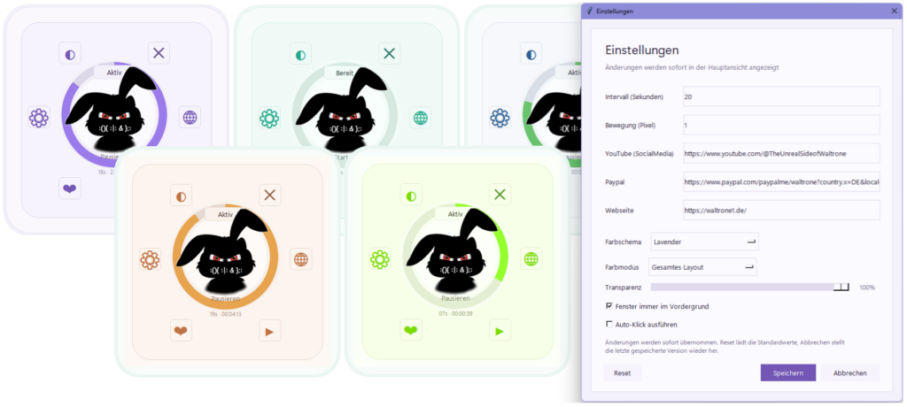

# waltrone1 Mouse-Keeper

**waltrone1 Mouse-Keeper** is a free Windows utility by **WALTRONE**.

It helps keep a Windows PC active during long-running tasks by reducing interruptions caused by standby, idle state or screensaver behavior.

The tool is designed for users, creators, admins and technicians who want a simple portable helper for long uploads, exports, render jobs, monitoring tasks, presentations, monitoring workflows or similar situations where the system should remain active.

---

## Screenshot



The screenshot shows the main Mouse-Keeper window, different color themes and the settings dialog with interval, movement, transparency, always-on-top and optional auto-click settings.

---

## Features

- Helps keep a Windows PC active during long-running tasks
- Small and focused desktop interface
- Portable Windows usage
- Configurable activity interval
- Configurable mouse movement distance
- Optional auto-click function
- Auto-click is disabled by default
- Always-on-top option
- Transparency setting
- Multiple color themes
- Settings window
- Quick start / pause workflow
- Useful for uploads, exports, rendering, presentations and monitoring
- Website, YouTube and support links configurable inside the application
- Application icon and branded WALTRONE mascot design
- py2exe build files for creating a Windows executable

---

## Use Cases

This tool can be useful for:

- Keeping a PC active during long YouTube uploads
- Preventing interruptions during render jobs
- Supporting long export tasks
- Keeping monitoring dashboards visible
- Reducing standby interruptions during presentations
- Helping with kiosk or display workflows
- Keeping remote desktop sessions more stable during longer tasks
- Avoiding manual mouse movement during controlled waiting periods
- Supporting simple background activity workflows on Windows

---

## Project Status

This project is currently available as a public release.

The repository provides source files, documentation, screenshots and build-related files for transparency and community access.

Current version:

```text
1.0.0.0
```

---

## Download

You can download the latest release from the GitHub Releases section.

A Gumroad download page may also be available for users who prefer a simple download option or want to support the project voluntarily.

---

## Repository Structure

```text
waltrone1-mouse-keeper/
│
├── README.md
├── CHANGELOG.md
├── LICENSE
├── .gitignore
│
├── docs/
│   └── usage.md
│
├── screenshots/
│   └── 01-main-overview.png
│
└── src/
    ├── assets/
    ├── mousekeeper/
    ├── py2exe/
    ├── main.py
    ├── version_info.txt
    └── waltrone1-Mouse-Keeper.ico
```

The `src/` folder contains the application source files, assets, icon and build-related files.

The `screenshots/` folder contains the image used in this README.

Generated files such as `.exe`, `.zip`, `build/`, `dist/` or release folders should not be committed directly to the repository.

---

## Basic Usage

1. Download the latest release.
2. Extract the ZIP file.
3. Start the application.
4. Choose the desired activity interval.
5. Choose the desired movement distance.
6. Start Mouse-Keeper.
7. Keep the application running while your long task is active.
8. Pause or close the tool when it is no longer needed.

---

## Optional Auto-Click

Mouse-Keeper includes an optional auto-click function.

This function is disabled by default and should only be enabled when you really need it.

Please use this option carefully and only in situations where automatic clicking is appropriate and allowed.

---

## Build / Source Notes

The source files are located in:

```text
src/
```

Build-related files for creating a Windows executable are located in:

```text
src/py2exe/
```

Generated build output such as `.exe`, `.zip`, `build/`, `dist/` or release folders should not be committed directly to the repository.

Final release packages should be published through GitHub Releases.

---

## Safety Notes

Mouse-Keeper is intended as a small local helper tool.

Important notes:

- Use only on systems where you are allowed to run such tools.
- Do not use auto-click in applications or environments where automated clicking is not permitted.
- Always review the settings before starting the tool.
- Stop or pause the tool when it is no longer needed.
- Some company environments may restrict tools that simulate activity.
- Use responsibly and only for legitimate workflows.

---

## License

This project is released under the **WALTRONE Community License**.

You may use this tool for free.

However, the following is not allowed without written permission:

- Commercial resale
- Rebranding
- Selling modified versions
- Commercial integration into paid products or services
- Republishing the project under another name
- Removing WALTRONE branding or author information

For details, see the `LICENSE` file.

---

## About WALTRONE

**WALTRONE** is a GitHub and community project focused on small, useful tools for Windows, automation, productivity and system management.

GitHub handle / domain identity:

```text
waltrone1
```

Project brand:

```text
WALTRONE
```

---

## Support

This tool is free to use.

If you find it useful, you may support the project voluntarily through the official WALTRONE download/support page.

---

## Disclaimer

This tool is provided as-is, without warranty of any kind.

Use it at your own risk.

The author is not responsible for data loss, system issues, unintended clicks, interrupted workflows, policy violations or damages caused by the use of this software.
